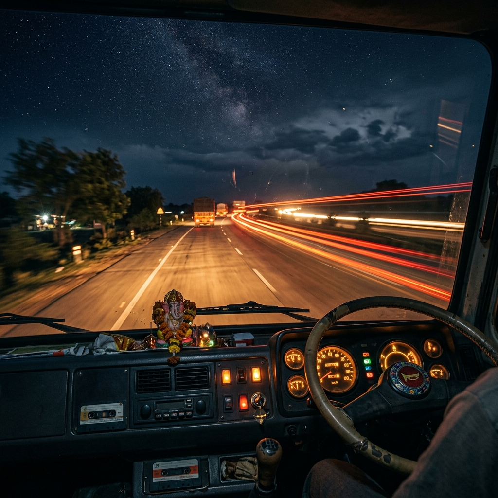
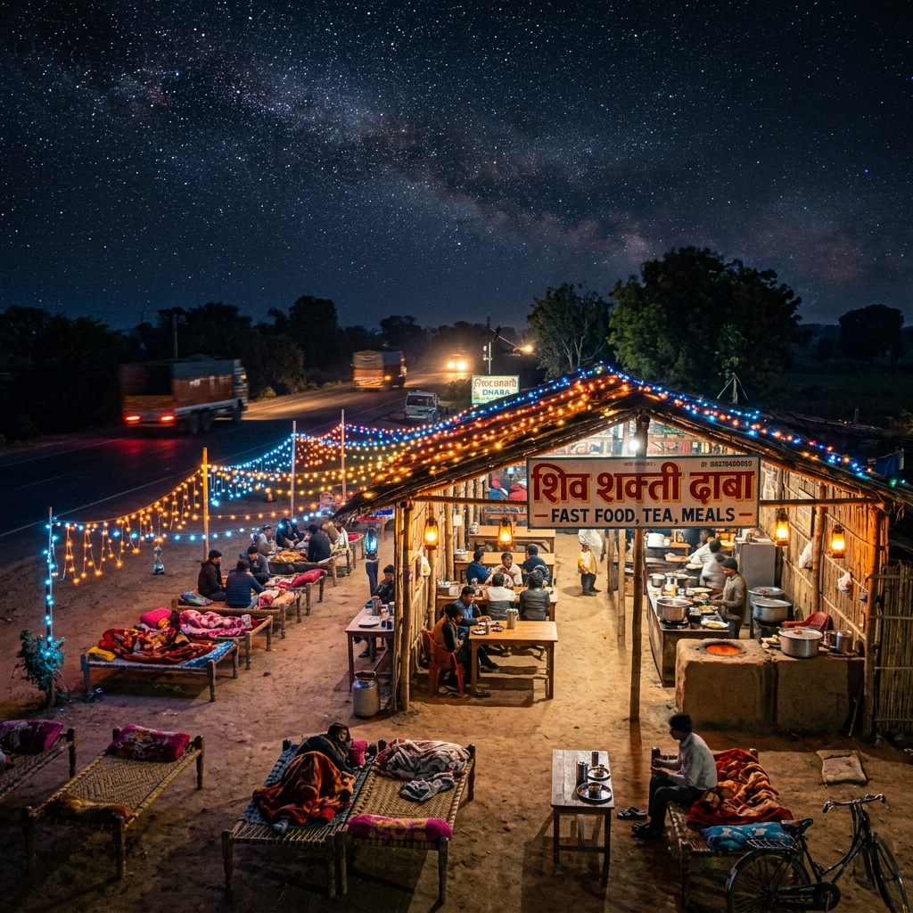
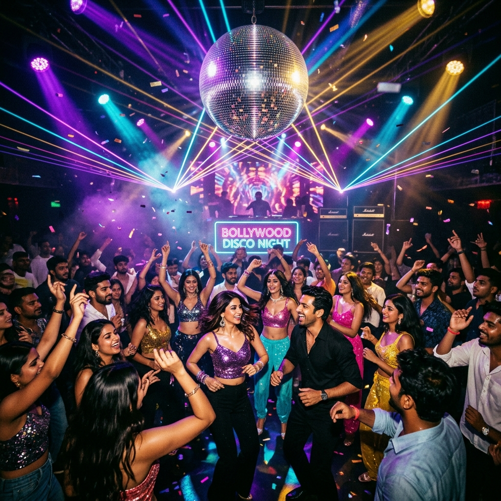
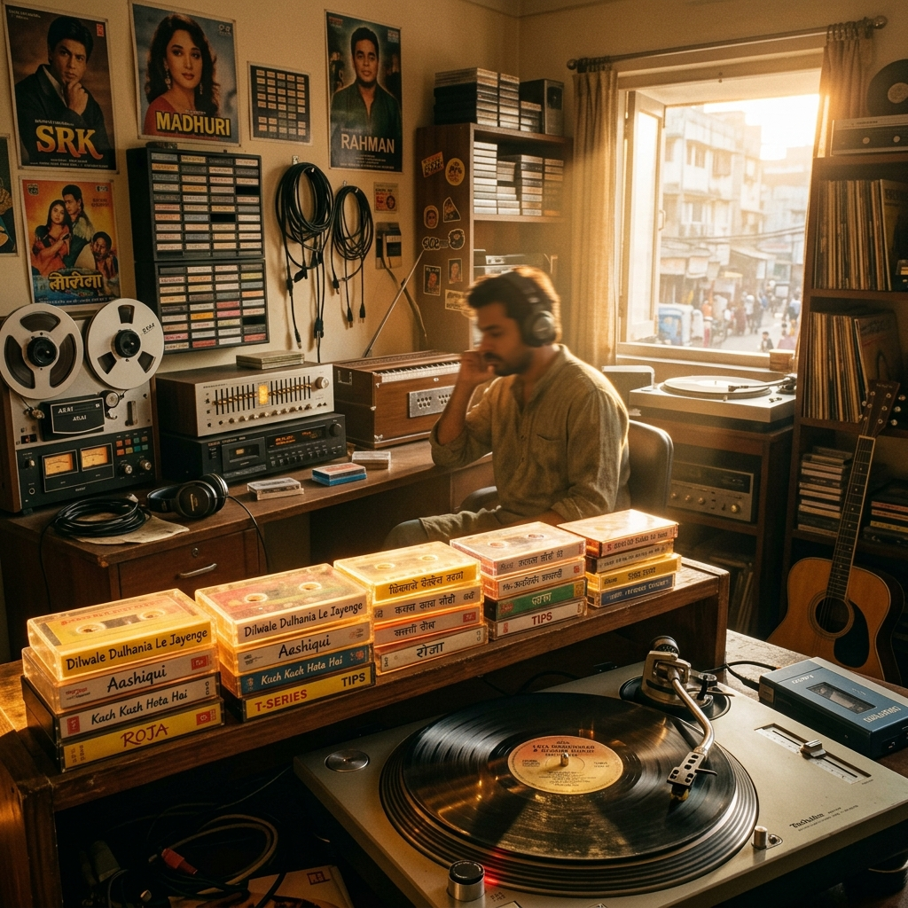

<p align="center">
  
</p>

<h1 align="center">हॉर्न ओके प्लीज</h1>
<p align="center"><strong>Horn OK Please</strong> · Hindi highway radio in the browser</p>

<p align="center">
  <a href="https://retroapp.streamlit.app/"></a>
  
  
</p>

<p align="center">
  Pick a station. It plays that station’s YouTube playlist.<br />
  Bumper slogans rotate. The horn actually honks. Weather follows you on the road.
</p>

<p align="center">
  <a href="https://retroapp.streamlit.app/"><strong>Open the radio →</strong></a>
  ·
  <a href="#run-it-on-your-machine">Run locally</a>
</p>

---

## Tune in

Six channels. One dashboard. No ads in the player — just the playlist you came for.

<table>
  <tr>
    <td width="50%" valign="top">
      
      <h3>🚛 हाईवे वाला रेडियो</h3>
      <p><em>सफर खूबसूरत है मंजिल से भी</em></p>
      <p>Truck-sticker Hindi, night tarmac, 90s bangers. Honk if you love this one.</p>
      <p>
        <a href="https://retroapp.streamlit.app/">Listen</a>
        ·
        <a href="https://www.youtube.com/playlist?list=PLfH-6xXh3waM">YouTube playlist</a>
      </p>
    </td>
    <td width="50%" valign="top">
      
      <h3>❄️ ढाबा सूफ़ियाना</h3>
      <p><em>सर्द हवा, कुल्हड़ की चाय और सूफ़ी की धुन</em></p>
      <p>Pull over. Kulhad chai, qawwali, and a tawa that never sleeps.</p>
      <p>
        <a href="https://retroapp.streamlit.app/">Listen</a>
        ·
        <a href="https://www.youtube.com/playlist?list=PLDd3GFEUXVbA">YouTube playlist</a>
      </p>
    </td>
  </tr>
  <tr>
    <td width="50%" valign="top">
      
      <h3>💿 २०००s डांस धमाका</h3>
      <p><em>रात के दो बजे डिस्को चलता है</em></p>
      <p>Item numbers, DJ babu, and the decade that refused to sit down.</p>
      <p>
        <a href="https://retroapp.streamlit.app/">Listen</a>
        ·
        <a href="https://www.youtube.com/playlist?list=PLPo3EhjC8W4A">YouTube playlist</a>
      </p>
    </td>
    <td width="50%" valign="top">
      
      <h3>📼 नब्बे का दशक</h3>
      <p><em>कैसेट पलटो, यादें लौट आओ</em></p>
      <p>Kumar Sanu, Alka, Doordarshan ads, walkman on / world off.</p>
      <p>
        <a href="https://retroapp.streamlit.app/">Listen</a>
        ·
        <a href="https://www.youtube.com/playlist?list=PLEFafAVNRJBo">YouTube playlist</a>
      </p>
    </td>
  </tr>
  <tr>
    <td width="50%" valign="top">
      
      <h3>🌿 मन की शांति</h3>
      <p><em>साँस लो, सुनो, शांत हो जाओ</em></p>
      <p>No rush. A station that sits with you until the night thins out.</p>
      <p>
        <a href="https://retroapp.streamlit.app/">Listen</a>
        ·
        <a href="https://www.youtube.com/playlist?list=PLANlPz-KKq6k">YouTube playlist</a>
      </p>
    </td>
    <td width="50%" valign="top">
      
      <h3>⚡ फ्रेड अगेन...</h3>
      <p><em>Feel it. Live it. Fred again.</em></p>
      <p>Late-night electronic, analog heart, 4/4 that finds you on a long drive.</p>
      <p>
        <a href="https://retroapp.streamlit.app/">Listen</a>
        ·
        <a href="https://www.youtube.com/playlist?list=PLZIT0z5Rfu98">YouTube playlist</a>
      </p>
    </td>
  </tr>
</table>

---

## Why it feels like the highway

- **Stations, not shuffle-of-everything** — each channel is its own YouTube playlist
- **हॉर्न ओके प्लीज** — a dual-tone truck horn, because of course
- **Bumper stickers that rotate** — Hindi slogans that change with the station
- **Weather on the dash** — uses your location when you allow it
- **Glass UI** — wordmark, vinyl disc, and a player that stays out of the way

Click **Play** the first time (browsers block autoplay). Then leave it on.

---

## Run it on your machine

```bash
cp .env.example .env
# optional: set OWM_API_KEY for live weather
python3 server.py
```

Open [http://localhost:3000](http://localhost:3000).

### Streamlit (same player as production)

The live site is `retroapp.py` (also `streamlit_app.py`). Streamlit Cloud inlines the player and bakes in each station’s tracks, so it does not need `server.py`.

```bash
pip install -r requirements.txt
streamlit run retroapp.py
```

Optional Streamlit secrets: `OWM_API_KEY`, `WEATHER_LAT`, `WEATHER_LON`.

Secrets stay in `.env` (not committed). The OpenWeatherMap key is used only on the server via `/api/weather`.

---

<p align="center">
  <strong>फिर मिलेंगे — हाईवे वाला रेडियो</strong><br />
  <a href="https://retroapp.streamlit.app/">Listen now</a>
</p>
